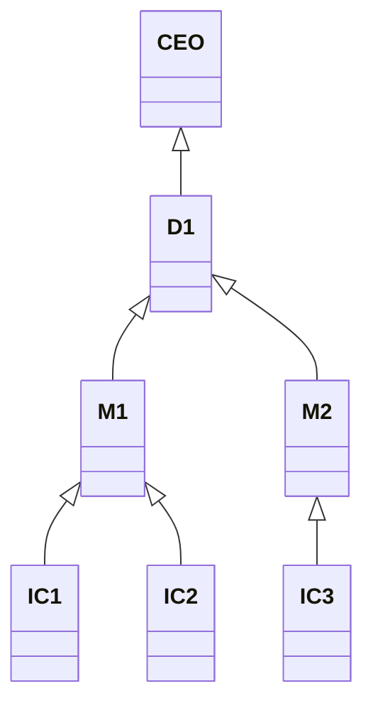

# grpcapp
grpc application


# Find the Reporting Chain

## Scenario

```text
In a company directory, every employee is part of a reporting chain leading up to the CEO.
There is a one-way upward link from each employee to their manager, but not vice-versa.
Given any employee, create a function that will output the whole reporting chain as an array from
that employee all the way to the CEO. See the diagram below:
```



Example 1:

```text
Input: IC3
Output: IC3, M2, D1, CEO
```

Example 2:

```text
Input: D1
Output: D1, CEO
```

## Reference Golang Skeleton Code

```go
package main

import (
  "errors"
  "fmt"
  "strings"
)

type Employee struct {
  Name string
  ID int
  Manager *Employee
}

func NewEmployee(name string, id int, manager *Employee) Employee {
  return Employee{
    Name: name,
    ID: id,
    Manager: manager,
  }
}

func findTheReportingChain(e *Employee) []string {
  var reportingChain []string
  /**
    Code goes here
  **/
  return reportingChain
}

func main() {
  ceo := NewEmployee("CEO", 1, nil)
  director1 := NewEmployee("D1", 2, &ceo)
  manager1 := NewEmployee("M1", 3, &director1)
  manager2 := NewEmployee("M2", 4, &director1)
  ic1 := NewEmployee("IC1", 5, &manager1)
  ic2 := NewEmployee("IC2", 6, &manager1)
  ic3 := NewEmployee("IC3", 7, &manager2)
  _ = ic1
  _ = ic2
  reportingChain1 := findTheReportingChain(&ic3)
  if !compareStringSlices(reportingChain1, []string{"IC3", "M2", "D1", "CEO"}) {
    fmt.Println(errors.New(("Reporting chain should be IC3, M2, D1, CEO, not: " + strings.Join(reportingChain1, ", "))))
  }
  reportingChain2 := findTheReportingChain(&director1)
  if !compareStringSlices(reportingChain2, []string{"D1", "CEO"}) {
    fmt.Println(errors.New(("Reporting chain should be D1, CEO, not: " + strings.Join(reportingChain2, ", "))))
  }
}

func compareStringSlices(slice1, slice2 []string) bool {
  if len(slice1) != len(slice2) {
    return false
  }
  for index, value := range slice1 {
    if value != slice2[index] {
      return false
    }
  }
  return true
}
```

## Reference Python Skeleton Code

```python
from typing import List

class Employee:
    def __init__(self, name, employee_id, manager):
        self.name: str = name
        self.employee_id: int = employee_id
        self.manager: Employee = manager


def find_the_reporting_chain(e: Employee) -> List[str]:
    reporting_chain = []
    #
    # Code goes here...
    #
    return reporting_chain


def main():
    ceo = Employee("CEO", 1, None)
    director1 = Employee("D1", 2, ceo)
    manager1 = Employee("M1", 3, director1)
    manager2 = Employee("M2", 4, director1)
    ic1 = Employee("IC1", 5, manager1)
    ic2 = Employee("IC2", 6, manager1)
    ic3 = Employee("IC3", 7, manager2)
    reporting_chain_1 = find_the_reporting_chain(ic3)
    reporting_chain_2 = find_the_reporting_chain(director1)
    # Assert the reporting chain is ["IC3", "M2", "D1", "CEO"]
    assert reporting_chain_1 == ["IC3", "M2", "D1", "CEO"]
    # Assert the reporting chain is ["D1", "CEO"]
    assert reporting_chain_2 == ["D1", "CEO"]


if __name__ == '__main__':
    main()
```

